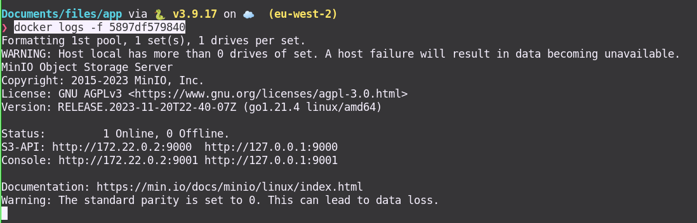

# File Upload and Download with FastAPI and MinIO

This repository demonstrates how to implement file upload and file download functionalities using FastAPI, a modern web framework for building APIs with Python, integrated with MinIO, an object storage server compatible with Amazon S3.

## Prerequisites

* All of this is part of the requirements so no need to install them since its dockerized.
- Python (3.7 or later)
- FastAPI (`pip install fastapi`)
- MinIO client (`pip install minio`)
- Docker (Mandatory, for running MinIO locally using Docker)

## Setup

1. Clone this repository:
   ```bash
   git clone https://github.com/davidkrdona/fastapi-minio-file-upload-download.git
   cd fastapi-minio-file-upload-download

2. Go to `files/` and run `docker-compose up -d`
3. Check dockers are running with `docker ps`
4. You should be able to check the api docs here http://localhost:8000/docs#/
### NOTE: Just in case you can't get it running check the IP for the FastApi docker with `docker inspect <docker-id> ` and use the IP 
Eg:
`"Gateway": "172.22.0.1, "IPAddress": "172.22.0.2", "IPPrefixLen": 16,`

This could also happen with the MinIO so please access on `http://localhost:9001/browser` or `http://172.22.0.2:9001/browser`



5. Once you have the API docs open you can test directly the API. Try upload and download files.


## License
This project is licensed under the MIT License.
